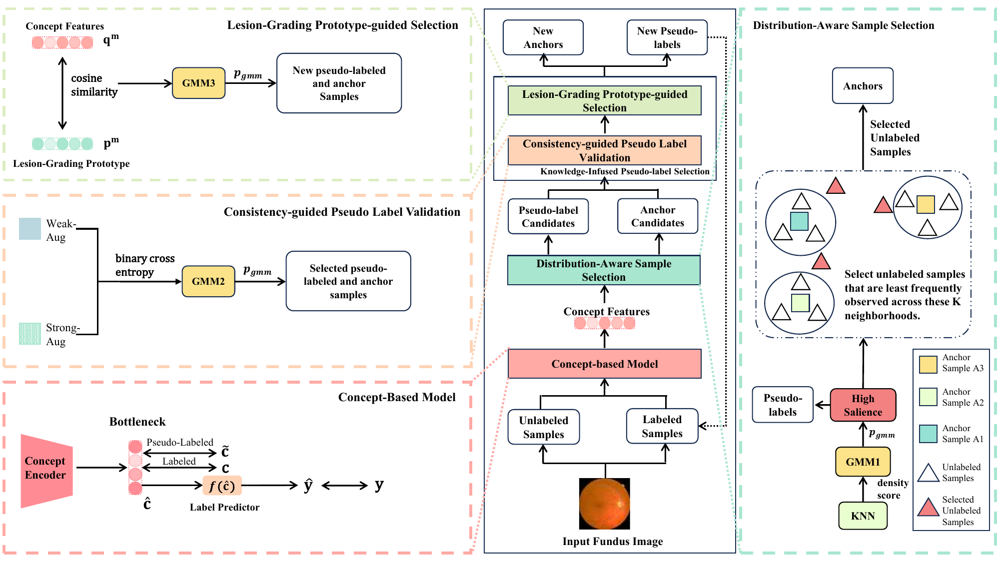

# Semi-Supervised Concept Infused Pseudo-Label Refining for Interpretable Diabetic Retinopathy Grading

Official PyTorch implementation of the ICASSP 2026 paper ["Semi-Supervised
Concept Infused Pseudo-Label Refining for Interpretable Diabetic Retinopathy
Grading"](https://ieeexplore.ieee.org/abstract/document/11462792).

IDR-SSCL performs semi-supervised diabetic retinopathy grading through a
concept layer for EX, HE, MA, and SE lesions. It includes both Concept
Embedding Model (CEM) and Concept Bottleneck Model (CBM) variants, with three
method components:

- DASS: distribution-aware sample selection using local density and a
  three-component Gaussian mixture model.
- CPLV: weak/strong-view concept-prediction consistency.
- LGPS: concept-representation similarity to the prototype of its predicted
  DR grade.

## Method Overview

[](Interpretable%20Diabetic%20Retinopathy%20Diagnosis%20with%20Semi-supervised%20Concept%20Layer.pdf)

## Code Structure

```text
configs/                     DDR/APTOS × CEM/CBM configurations
src/cli.py                   construct, train, and evaluate commands
src/data_interface.py        manifest-driven datasets and data loaders
src/models/idr_sscl_cem.py   CEM implementation, DASS, CPLV, and LGPS
src/models/idr_sscl_cbm.py   CBM implementation, DASS, CPLV, and LGPS
src/models/cbm.py            shared CEM/CBM lifecycle
src/train/runner.py          training, checkpoint loading, and evaluation
src/train/metrics.py         DR-grading and lesion-concept metrics
```

## Installation

Python 3.10–3.12 is supported.

```bash
python -m venv .venv
source .venv/bin/activate
python -m pip install --upgrade pip
python -m pip install -e .
python -m src.cli --help
```

## Data

The paper uses a lesion subset composed of FGADR, DDR-subset, and
Retinal-Lesions, together with DDR or APTOS. Medical images and annotations
are not redistributed; obtain authorized copies under each dataset's terms.

Use separate CSV manifests for training, validation, and testing:

```csv
image_path,dr_grade,is_concept_labeled,EX,HE,MA,SE
images/example.png,2,true,1,1,0,0
```

`image_path` is relative to the manifest, `dr_grade` is an integer from 0 to
4, and lesion concepts are binary. For rows where `is_concept_labeled=false`,
concept values are ignored during training.

## Training

```bash
python -m src.cli train \
  --config configs/ddr_idr_sscl_cem.yaml \
  --train-manifest manifests/ddr/train.csv \
  --val-manifest manifests/ddr/val.csv \
  --test-manifest manifests/ddr/test.csv \
  --output-dir outputs/ddr_cem
```

Available configurations:

```text
configs/ddr_idr_sscl_cem.yaml
configs/ddr_idr_sscl_cbm.yaml
configs/aptos_idr_sscl_cem.yaml
configs/aptos_idr_sscl_cbm.yaml
```

Add `--imagenet-weights` to use torchvision ImageNet initialization. For GPU
training, pass `--accelerator gpu --devices 1`.

## Evaluation

```bash
python -m src.cli evaluate \
  --config configs/ddr_idr_sscl_cem.yaml \
  --manifest manifests/ddr/test.csv \
  --checkpoint outputs/ddr_cem/checkpoints/your-checkpoint.ckpt \
  --metrics-output outputs/ddr_cem/evaluation.json
```

The evaluator reports quadratic Kappa, macro AUC, accuracy, and macro F1 for
DR grading, plus macro AUC, accuracy, and micro F1 for lesion concepts when
annotations are available.

## Citation

```bibtex
@INPROCEEDINGS{11462792,
  author={Gao, Yuxuan and Wen, Chi and Li, He and Tan, Qingxiong and Ye, Mang},
  booktitle={ICASSP 2026 - 2026 IEEE International Conference on Acoustics, Speech and Signal Processing (ICASSP)}, 
  title={Semi-Supervised Concept Infused Pseudo-Label Refining For Interpretable Diabetic Retinopathy Grading}, 
  year={2026},
  volume={},
  number={},
  pages={8082-8086},
  keywords={Feeds;Filtering;Filters;Circuits and systems;Radio frequency;Protocols;HTTP;Radio communication;Plugs;Learning (artificial intelligence);Interpretable Diagnosis;Concept-based Model;Semi-supervised Learning},
  doi={10.1109/ICASSP55912.2026.11462792}}
```

## License

This project is released under the [Apache License 2.0](LICENSE).
